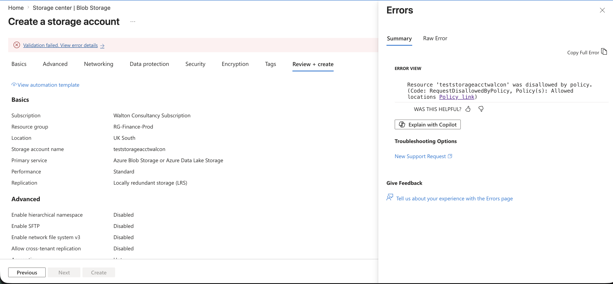

# Azure AZ-104 Infrastructure Lab Portfolio

Welcome to my hands-on Azure infrastructure portfolio. This repository documents my practical implementation of enterprise scenarios mapping directly to the official AZ-104 administration domains.

---

## Domain 1: Manage Azure Identities and Governance

### Project Objective
To architect a secure, multi-department enterprise identity boundary using Microsoft Entra ID, enforce precise Role-Based Access Control (RBAC), and implement rigid automated compliance guardrails.

---

### Architecture Features, Verification Logs & Design Decisions

#### 1. Identity Matrix & Role-Based Access Control (RBAC)
- Isolated administrative domains by provisioning dedicated corporate security groups (`Fin-Admin-Group` and `Sec-Ops-Group`) and mapping structured test users.
- Allocated the built-in **Contributor** role to the finance team and the **Reader** role to the security operations team.
- *Verification Log:* Active identity matrix and role allocations:
  

> **Design Decision — Scope Limitation:** > Rather than granting permissions at the global Management Group or Subscription level, RBAC roles were strictly scoped to the specific production Resource Group (`RG-Finance-Prod`). This enforces the **Principle of Least Privilege (PoLP)**, ensuring the financial team has zero modification access to other corporate departments, minimizing the potential blast-radius of compromised credentials.

#### 2. Least-Privilege Access Enforcement
- Actively validated permission boundaries by logging into an audit session using a test account assigned to the security team (`Sec-Ops-Group`). 
- Attempted to provision a new storage account inside the production environment to verify plane isolation.
- *Verification Log:* The Azure control plane successfully terminates unauthorized write actions:

> **Design Decision — Separation of Duties:** > Security operations teams require complete visibility to audit logs and monitor configurations, but should never have operational write permissions over infrastructure assets. Restricting this team to a strict read-only boundary ensures proper separation of duties and prevents unauthorized configuration changes during an audit.

#### 3. Automated Regional Governance Guardrails
- Implemented an Azure Policy assignment enforcing the **Allowed Locations** compliance rule, strictly limiting deployment parameters to a single approved geographic region.
- Validated enforcement by executing an administrative deployment attempt targeted to an unapproved secondary region.
- *Verification Log:* Automated policy intervention blocking a non-compliant deployment layout during pre-flight validation:

> **Design Decision — Geofencing for Data Sovereignty & Cost Control:** > Unrestricted deployment access can lead to severe data sovereignty violations (e.g., GDPR data boundary breaches) and massive, unexpected cloud spend from premium out-of-region instances. Hardcoding regional restrictions via Azure Policy automates compliance enforcement without requiring manual human oversight.

#### 4. Blast-Radius Control & Accidental Deletion Protection
- Applied administrative **Delete Resource Locks** directly to the core production Resource Group plane.
- Tested structural stability by attempting an intentional manual deletion command on a live asset.
- *Verification Log:* Native platform defense intercepting and rejecting the deletion attempt:

> **Design Decision — Human-Error Mitigation:** > In a fast-paced environment, catastrophic data loss and infrastructure downtime frequently occur due to accidental deletion commands executed in the wrong browser tab or portal console. Placing an explicit Delete Lock introduces a critical engineering roadblock, requiring an intentional, multi-step administrative override before production components can be destroyed.

---

## Domain 2: Implement and Manage Storage Solutions

### Project Objective
To architect a secure, high-availability corporate storage architecture utilizing automated data lifecycle policies and network-level isolation to prevent public data exposure.

### Architecture Features & Verification Logs

#### 1. Geo-Redundant Storage (GRS) Provisioning
- Deployed a production-tier storage account utilizing **Geo-redundant storage (GRS)** to automatically replicate data to a secondary region hundreds of miles away.
- **Design Decision:** Budgetary constraints often favor LRS (Locally Redundant Storage), but financial compliance dictates a strict disaster recovery strategy. GRS was selected to guarantee business continuity and durability against a total primary data center failure.
- *Verification Log:* Live cross-region replication matrix:

#### 2. Network-Level Storage Isolation (Firewalling)
- Enforced zero-trust access boundaries by disabling public internet routing to the storage endpoint. Restricted access strictly to the corporate `Prod-VNet` backend subnet and designated administrative client IPs.
- **Design Decision:** Storage accounts are publicly accessible by default via internet endpoints, creating a significant data exfiltration risk. Locking the firewall to selected virtual networks completely mitigates external brute-force vectors.
- *Verification Log:* Applied storage firewall perimeter configurations:

#### 3. Automated Data Lifecycle Management
- Implemented declarative lifecycle management rules to automatically transition un-modified financial objects across storage tiers based on age.
- **Design Decision:** To optimize cloud expenditure without human intervention, files transition to Cool storage after 30 days and Archive storage after 90 days. This keeps high-performance Hot tier storage reserved purely for active operations, drastically reducing monthly consumption costs.
- *Verification Log:* Visual rule parameters for automated file aging:

